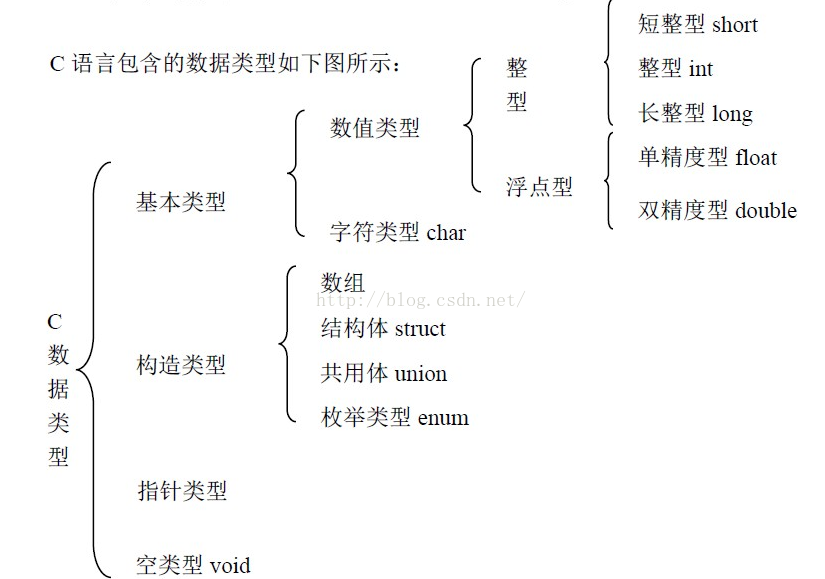
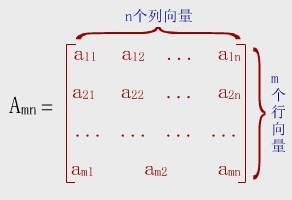

# 17 C Train

C training for 17 fresh man

## 10.14 大一c语言培训

### 时间: 8:00 - 12:00
 + 初始代码：(你好，世界！打开新世界的大门！)
```c
    #include<stdio.h>
    int main()
    {
        printf("Hello World\n");
        return 0;
    }
```

+ 代码编写规范
   - 标识符命名规范：标识符只能由字母(A~Z, a~z)、数字(0~9)和下划线_组成，并且第一个字符必须是字母或下划线


 + 顺序结构：
   + 基本数据类型
      -     
      - `char, short, int, long int, float, double`
      - 基本数据类型所占直接数与三个方面因素有关：
       - CPU位宽(即你的CPU是多少位的)
       - 操作系统位宽(笼统说就是操作系统位数，操作系统位宽取决于CPU位宽)
       - 编译器类型和版本


数据类型 | 所占字节数 | 取值范围
------------ | ------------- | -------------
short | 2 | 	-32768~32767，即 -215~(215-1)
unsigned short | 2 | 0~65535，即 0~(216-1)
int | 4 | -2147483648~2147483647，即 -231~(231-1)
unsigned int | 4 | 	0~4294967295，即0~(232-1)
long | 4 | -2147483648~2147483647，即 -231~(231-1)
unsigned long | 4 |	0~4294967295，即0~(232-1)
   - 无符号(unsigned)与有符号(signed)的区别(int为例子)
    - 一般的，在你未定义是无符号(unsigned)时，编译器默认的是有符号型(signed)
    - 两者的区别与数值在内存中的存储有关。(原码、反码和补码)
    - 举例子为：  


    ```
    unsigned int a;
    int b = -1;
    a = b;
    printf("a=%u",a);
    ```   


   - 关系运算符

关系运算符 | 含义
------- | --------
<	| 小于
<=	| 小于或等于
>	| 大于
>=	| 大于或等于
==	| 等于
!= |	不等于

   - 逻辑运算符


运算符	| 说明
------- | --------
&&	| 与运算，双目，对应数学中的“且”
 ``||`` |或运算，双目，对应数学中的“或”
  !	| 非运算，单目，对应数学中的“非”

   - 转义字符
      - `\n, \t，\0`
   - i++与++i的区别
      - ++ 在前面叫做前自增（例如 ++a）。前自增先进行自增操作，再进行其他操作。
      - ++ 在后面叫做后自增（例如 a++）。后自增先进行其他操作，再进行自增操作。
      ```
      int a,b,c,d;
      a = 2;
      b = 3;
      c=a++;
      d=++b;
      ```
      - 自减（--）也一样，有前自减和后自减之分。
      - 自增自减完成后，会用新值替换旧值，并将新值保存在当前变量中。自增自减只能针对变量，不能针对数字
   - 输入输出
      - `getchar()` 和 `putchar()` : 字符的输入输出
      - `gets()` 和 `puts()` : 字符串的输入输出
      - `scanf()` 和 `printf()` : 可以输入输出各种类型的数据


数据类型  |  输出格式      
---- | -----
 int   |  %d
 long   int   |  %ld
char    |  %c  
float   | %f  
double  |  %lf   
八进制整数 | %o
指针 | %p
无符号十进制整数 | %u
   - 常量
      - `const int max = 100;`
      - const与define所申明的是有区别的。const只是将变量申明成只读的。
      - ``#define MAX 100``  (宏定义)
       - 数值宏常量：例如： ` #define a 10 ` (注意，中间是有空格的)
       - `#define`替换：在调用宏时，首先对其参数检查，如果参数又包含`#define`定义的符号，则会被替换。
       - `#undef`用于移除一个宏定义
   - 变量
    - `int a = 1;`   


******
+ 选择结构：
   - if-else语句
      ```
        if(判断条件)
        {
            //真 to-do
        }
        else
        {
            //假 to-do
        }
      ```
   - switch语句
      ```
        switch(表达式)
        {
            case 数字/单个字符：
                // to-do
                break;
            case 数字/单个字符：
                // to-do
                break;
            default:
                // to-do
                break;
        }
      ```
   - 三目运算符 ：
      `判断条件 ? 真 : 假;`    


##### 题目：
` 请编写一个程序，它的功能是：计算三位整数中的各位数字之和。输入一个三位整数，函数返回各位数字之和。`


+ 循环结构：
    - while循环
        ```
          while(表达式)
          {
              // to-do
          }
        ```
    - do-while循环
        ```
        do
        {
          // to-do
        }while(表达式);  //do-while后面要加分号
        ```
    - for循环
      ```
        for(循环变量的初始化; 循环判断条件; 循环递增条件)
        {
            // to-do
        }
      ```
        - **什么时候用whlie或do-while:**
          1. 循环次数不确定
          2. 循环的改变不是递增或递减
    - continue和break的区别
        - `continue` **结束本次** 循环，进行下一次循环  
          `break` **终止** 循环不再进行
******


##### 题目：
 ` 请编写一个程序，它的功能是：统计素数的个数。输入一个自然数n（n在100到10000之间），函数返回100到n之间（包括n）素数的个数。`


+ 代码块：
  - 代码块就是位于一对大括号之内的可选的声明可语句列表。简单的来讲，一对大括号内的就是一个代码块。


******   


+ 数组：
  - 一维数组
   - 定义与初始化：数组在声明的时候必须指定其大小，如：`a[10]`，因为数组内存的分配是在编译期间进行的
   - 内存布局与边界：一维数组在内存中是连续存储的，其中下标从0开始
   - 不完整初始化：例如：`int b[5]={1};`，则默认第一个元素是1，其余的都是0。
   - 字符串数组的初始化：例如：`char c[5]={'h','e','l','l','o'};`和`char c[]="hello";`两者是不同的，字符串默认以'\0'结尾
  - 二维数组
   - 存储顺序：二维数组可以看成是一个一维数组，只不过这个一维数组里面的元素又是一个一维数组。所以还是以线性存储的方式存储在内存中。
   - 数组名：二维数组的数组名是一个数组指针，它指向第0行。例如：`int a[3][4];`。其中，`a[i]`是每行首元素的地址。`&a[i]`是一个数组指针，代表每行的地址。
   - 例如：二维数组A[m][n]可以视为由m个行向量组成的向量，或者是由n个列向量组成的向量。
   - 
   - 访问形式：二维数组的访问形式有下标和解引用两种形式，不过即使是下标访问也是先被解析成解引用的形式再访问的。例如：要访问第三行第四列，则有，`1、a[3][4];2、*(*(a+3)+4)`
******  


##### 题目：
`统计数列中符合条件数据的个数，输入10个整数构成一个数列，返回数列中正整数的个数。`


******


##### 题目：
`将一个数组中的值按照逆序重新存放。原数组（包含5个元素），逆序之后进行输出。例如：1 2 3 4 5 输出为：5 4 3 2 1`  


******   


+ 函数：
  - 定义：函数的定义就是函数体的体现，函数体就是一个代码块，它在函数被调用时执行。`函数定义语法：类型 函数名(形参) {函数体}`。如：`int query(char a[],int x) {}`
    - 第一种使用函数方式：

    ```
    void main()
    {
      void output();
      int a;
      ...
    }

    void output()
    {
      printf("HelloWorld!\n");
    }
    ```

    - 第二种使用函数方式：

    ```
    void output()
    {
      printf("HelloWorld!\n");
    }

    void main()
    {
      void output();
      int a;
      ...
    }

    ```
  - 参数：
   - 参数传递：传值与传地址。要想在变量所声明的代码块外部改变变量，则应该进行“传地址”。

  - 形参与实参

  ```
  void add(int a,int b)
  {
    ...
  }
  void main()
  {
    int c,d;
    c = 1;
    d = 2;
    add(c,d);
  }
  ```

  - 递归的使用
   - 递归函数就是直接或间接的调用自身函数。递归必须要有递归的终止条件。
   - `下面是一个5的阶乘的递归的例子：`   
   
```c
   int factorial(int n)
 {
     int result;
     if (n<0)                                         
     {
         printf("输入错误!\n");
         return 0;
     }
     else if (n==0 || n==1)
     {
        result = 1;  					                          
     }
     else
     {
        result = factorial(n-1) * n;            
     }
     return result;
 }
 int main()
 {
     int n = 5;                                             
     printf("%d的阶乘=%d",n,factorial(n));
     return 0;
 }
```
